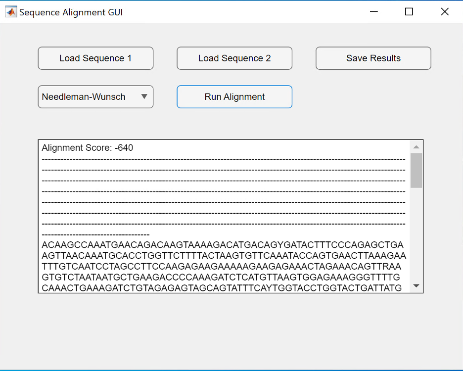
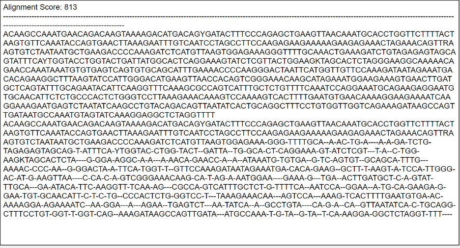
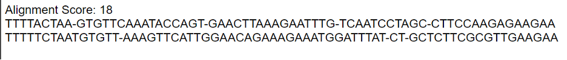
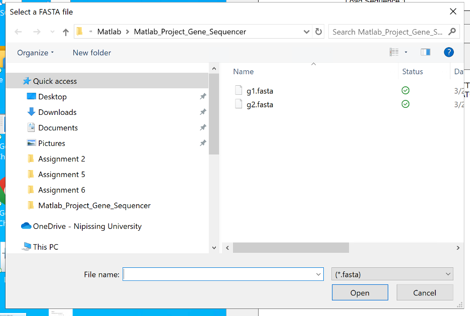
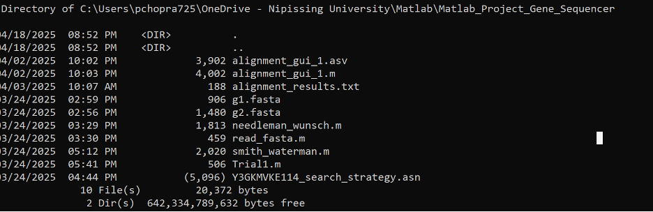

# Genetic Sequence Alignment Tool in MATLAB  
**Developer**: Parth Chopra  

This MATLAB-based GUI tool performs pairwise genetic sequence alignment using the Needleman-Wunsch (Global) and Smith-Waterman (Local) algorithms. It supports input in FASTA format and visualizes the alignment process and results, making it suitable for bioinformatics research and educational purposes.

---

##  Features

-  User-friendly MATLAB GUI
-  FASTA file input support
-  Global (Needleman-Wunsch) & Local (Smith-Waterman) alignment
-  Dynamic programming matrix visualization
-  Alignment score display

---

##  Algorithms Implemented

### 1. Needleman-Wunsch (Global Alignment)
- Aligns entire sequences
- Useful for comparing sequences of similar length and composition

### 2. Smith-Waterman (Local Alignment)
- Aligns subsequences
- Ideal for finding conserved regions within larger sequences

---
## GUI Screenshots

***Figure 1*** Output area with aligned sequences

---

***Figure 2*** Needleman-Wunsch Algorithm output.

---

***Figure 3*** Smith-Waterman Algorithm output.

---

***Figure 4*** Choose and save FASTA files with GUI.


##  File Structure

- `alignment_gui.m` – Main file to run the GUI
- `needleman_wunsch.m` – Function implementing global alignment
- `smith_waterman.m` – Function implementing local alignment
- `read_fasta.m` – FASTA file reader
- `score_matrix.m` – Scoring system setup
- `sample_sequences.fasta` – Sample FASTA input

---

***Figure 5*** File Structure

##  Getting Started

### Requirements
- MATLAB R2020 or later

### Run Instructions
1. Clone or download this repository.
2. Open MATLAB and set the working directory.
3. Run the GUI:
    ```matlab
    alignment_gui
    ```

---

##  License

This project is open source and free to use under the MIT License.

---

##  Contact

**Parth Chopra**  
📧 [LinkedIn](https://www.linkedin.com/in/parth-chopra07)  
